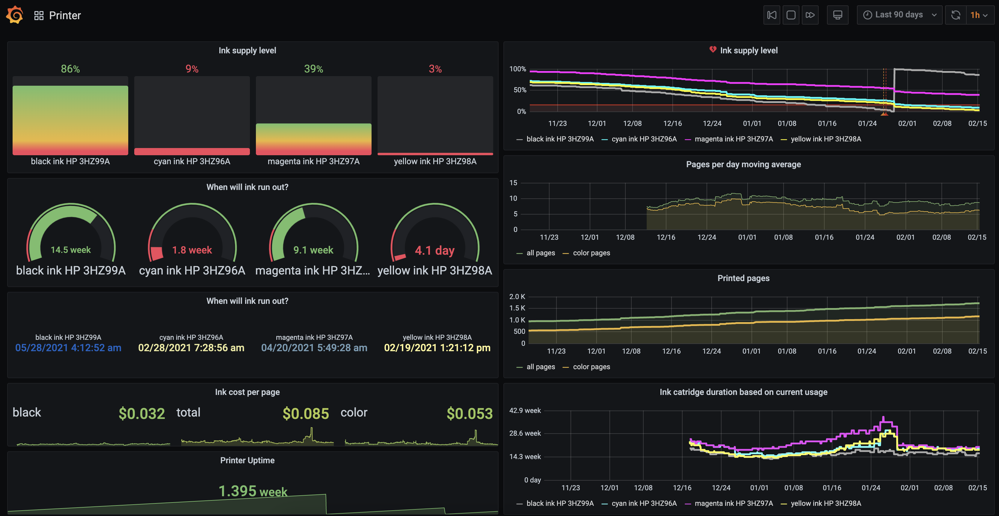
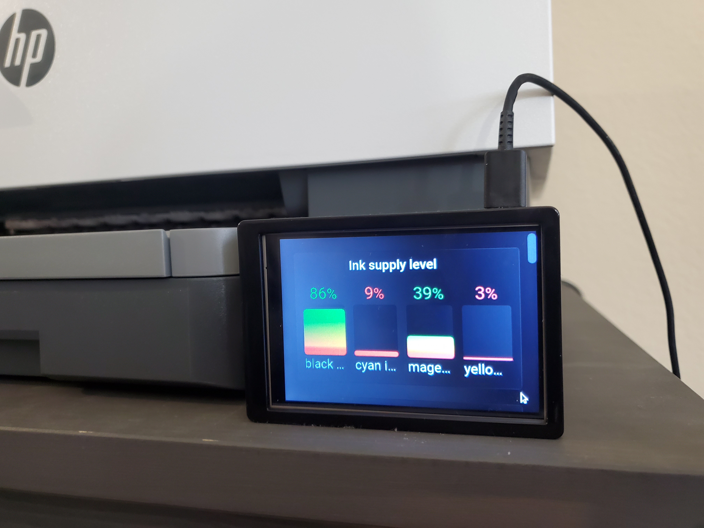

# Smarter Printer

Today, printers are smart but not as smart as they could be.
Certainly, the smartness is typically not customisable and the user only
gets basic statistics of whatever the manufacturer provided.
This project allows the users to gain better control over the data and
customise the view to their liking.

Apart from the practical need (which can be quite arguable), there is also the aspect
of building the framework that can be reused in further applications
and serving as a proof-of-concept how much useful statistics can be extracted from
such a seemingly simple stream of data as the number of printed pages over time.

Without further ado, here is a screenshot from the user-facing application
that should be pretty self-explanatory to showcase what it does:

### Features

- historical data of the ink supply per cartridge
- projected ink supply duration per cartridge
- historical data of printed pages and moving average of pages per day
- estimated cost per page (parametrized by the cost of the cartridges)
- email alerts about low ink supply

## Ingredients

| Component Function     | Specific Component | Description |
| ---------------------- | ------------------ | ----------- |
| Printer                | [HP OfficeJet Pro 9015](https://www.hp.com/us-en/shop/pdp/hp-officejet-pro-9015-all-in-one-printer) | A smart printer that supports SNMP protocol |
| Local Data Publisher   | [Raspberry Pi 4 Model B Rev 1.1](https://www.raspberrypi.org/products/raspberry-pi-4-model-b/specifications/) | A Unix machine in the same local network as the printer |
| Server                 | [OVHcloud VPS](https://us.ovhcloud.com/vps/) (Value) | A Unix server that serves as a data broker |
| (Optional) Domain Name | [Namecheap](https://www.namecheap.com/domains/) ".org" domain | A domain for easier access and setup |

## Architecture

### Diagram

### Home

The home setup can hardly be simpler.

Firstly, the printer needs to be connected to the local network and support
SNMP ([Simple Network Management Protocol](https://en.wikipedia.org/wiki/Simple_Network_Management_Protocol)).
Here is an [example](./images/snmp_setup.png) of enabling it for the HP printer
used for this project.

Second, the local server (Raspberry Pi) queries the printer in regular intervals over
the SNMP and publishes the data to the remote server which stores them and serves them
to the end-user. For further details on the setup on this component, see [pi/](./pi/) folder.

### Server

The server side is a standard TIG stack (**T**elegraf, **I**nfluxDB, **G**rafana).
Technically, the server-side Telegraf might not be necessary for an even simpler
architecture where the client-side Telegraf publishes directly to the InfluxDB.
However, this way has some minor advantages and it is certainly a more standard set up.

All details of the server configuration are located in [server/](./server/) folder.

> Why not use an open-source home automation solution like Home Assistant or openHAB?

- The TIG stack is extremely lightweight, running even on the cheapest VPC instance unlike most of the other bespoke solutions.
- The proposed architecture is very customisable as all of the used components are completely generic.

## Deployment

Sadly, there is no automatic deployment pipeline for this project.
All components are manually set up as *snowflakes*.
The most recent stable versions of all programs are installed unless specified otherwise.
Furthermore, basic authentication and network credentials are filled directly in the configuration files.
We attempt to hint at the most likely location of the configuration files, but it may
vary depending on the specific system used.

## Bonus - Touchscreen User Terminal

[Raspberry Pi 4 Touch Screen with Case, 3.5 inch Touchscreen with Fan, 320x480 Monitor TFT LCD Game Display
](https://www.amazon.com/gp/product/B07WQW6H9S)

(**Unfortunately** - the fan makes quite a bit of noise, but it is a cute final *touch* for the project)

## Next Steps

- Grafana has an [option](https://grafana.com/grafana/plugins/grafana-image-renderer/) to include a snapshot of the dashboard in the email alerts. However, the setup is quite complicated, requiring a standalone image renderer typically provided as a headless Chromium browser. This small feature ends up significantly increasing the memory and disk requirements.
- Many pieces of this project are quite general components that can be reused in similar home monitoring applications. They can be turned into a library which then allows easier addition of further devices.
