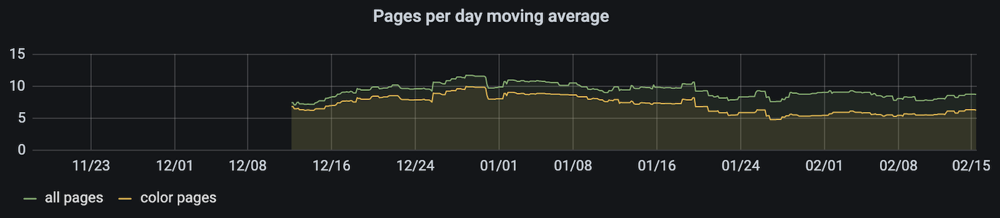

# Grafana

## Basic Setup

For simplicity, the following configuration assumes that Grafana
is deployed on the same server as InfluxDB.
It can be easily adjusted if it is hosted separately, for example at
[Grafana Cloud](https://grafana.com/products/cloud/).

### Configuration

```
[users]
# disable user signup / registration
allow_sign_up = false

[server]
# Protocol (http, https, h2, socket)
protocol = http

# The http port to use
http_port = 3000

# The public facing domain name used to access grafana from a browser
domain = your.domain.org

# The full public facing url you use in browser, used for redirects and emails
# If you use reverse proxy and sub path specify full url (with sub path)
root_url = http://your.domain.org
```

### Data Source

All the data for this project are stored in InfluxDB.
There are two differrent Query Languages for which it can be configured.
Some of the basic queries (see below) use a simple **InfluxQL**, but for
a more sophisticated functionality, setting up a more advanced and complicated
**Flux** is almost a necesity.

**[InfluxQL](https://docs.influxdata.com/influxdb/v1.8/query_language/)**

- URL: `http://127.0.0.1:8086`
- Database: `INFLUX_DATABASE_NAME`
- User: `grafana`
- Password: `GRAFANA_INFLUX_PASSWORD` (chosen when configuring InfluxDB)

**[Flux](https://docs.influxdata.com/influxdb/v2.0/query-data/get-started/)**

- URL: `http://localhost:8086`
- Organization: `admin`
- Default Bucket: `INFLUX_DATABASE_NAME`

## Queries

### Trivial

The most basic queries just display the metrics as-is from the database.


Grafana's built-in UI supports these basic queries without the need to write any code.


### Straightforward

Sliglty more complicated queries require writing a query in the InfluxQL language



```
SELECT moving_average(derivative(last("total-engine-page-count"), 1d), 200)
FROM "snmp"
WHERE $timeFilter
GROUP BY time($__interval) fill(null)
```

This query computes the difference of the total number of printed pages between
consecutive days. However, because this metric would be very noisy, it is
smoothed over 200 days by computing moving average. This approach provides
a sense of a long-term trend rather than an instant measurement for individual days.

### Advanced

Finally, some of the most fancy functionality of the dashboard is built on Flux
queries.


In fact, the query for the above 3 plots is quite similar, therefore we only
show here the query for the last one, other queries can be found in the full
configuration [model.json](./model.json).

```
// Compute the daily consumption rate for each cartridge, excluding the negative values that
// typically mean that the cartridge was actually replaced on that day.
ConsumptionRate = from(bucket: "hlasek_home")
  |> range(start: v.timeRangeStart, stop: v.timeRangeStop)
  |> filter(fn: (r) => r._measurement == "printer" and r._field == "prtMarkerSuppliesLevel")
  // By flipping the values we then compute the rate of decrease rather than of increase.
  |> map(fn: (r) => ({r with _value: -r._value}))
  |> derivative(unit: 1d, nonNegative: true)
  |> mean()

// For each cartridge, extract the current ink level.
CurrentLevel = from(bucket: "hlasek_home")
  |> range(start: v.timeRangeStart, stop:v.timeRangeStop)
  |> filter(fn: (r) => r._measurement == "printer" and r._field == "prtMarkerSuppliesLevel")
  |> last()

// Join the above two tables according to the cartridge they represent.
RateAndCurrent = join(
  tables: {current_level: CurrentLevel, consumption_rate: ConsumptionRate},
  on: ["prtMarkerSuppliesDescription"]
)

// Compute the running out date as a linear projection of the consumption rate
// from the current rate and date.
RunningOutDateMs = RateAndCurrent
  // Take the date from the end of the selected time range and convert it to unit.
  |> map(fn: (r) => ({r with _value: v.timeRangeStop}))
  |> toUInt()
  // Add the number of days (in nanoseconds) that the current level of ink will
  // last at the constant consumption rate.
  |> map(fn: (r) => ({
      r with _value: r._value + uint(
        v: 1000000000.0 * 60.0 * 60.0 * 24.0 *
        float(v: r._value_current_level) / r._value_consumption_rate
      )
    })
  )
  // Convert the time to miliseconds so that Grafana can conveniently display it.
  |> map(fn: (r) => ({r with _value: r._value / uint(v: 1000000)}))
  |> keep(columns: ["_value", "_field", "_time", "prtMarkerSuppliesDescription"])

yield RunningOutDateMs
```


Finally, here comes the query that estimates the cost of the ink per printed page:

```
BLACK_CARTRIDGE_COST = 32.89
COLOR_CARTRIDGE_COST = 63.89

SMOOTHING_DAYS = 120

TotalPagesRate = from(bucket: "hlasek_home")
  |> range(start: v.timeRangeStart, stop:v.timeRangeStop)
  |> filter(fn: (r) => r._measurement == "snmp" and r._field == "total-engine-page-count")
  |> derivative(unit: 1d, nonNegative: true)
  |> movingAverage(n: SMOOTHING_DAYS)

ConsumptionRate = from(bucket: "hlasek_home")
  |> range(start: v.timeRangeStart, stop:v.timeRangeStop)
  |> filter(fn: (r) => r._measurement == "printer" and r._field == "prtMarkerSuppliesLevel")
  |> map(fn: (r) => ({r with _value: -r._value}))
  |> derivative(unit: 1d, nonNegative: true)

BlackConsumptionRate = ConsumptionRate
  |> filter(fn: (r) => r.prtMarkerSuppliesDescription == "black ink HP 3HZ99A")
  |> movingAverage(n: SMOOTHING_DAYS)

ColorConsumptionRate = ConsumptionRate
  |> filter(fn: (r) => r.prtMarkerSuppliesDescription != "black ink HP 3HZ99A")
  |> group()
  |> sort(columns: ["_time"])
  |> timedMovingAverage(every: 1h, period: 1h)
  |> movingAverage(n: SMOOTHING_DAYS)

JoinedPagesRateAndBlackConsumptionRate = join(
  tables: {total_pages_rate: TotalPagesRate, consumption_rate: BlackConsumptionRate},
  on: ["_time"]
)

BlackInkPerPage = JoinedPagesRateAndBlackConsumptionRate
  |> filter(fn: (r) => r._value_total_pages_rate > 0.01)
  |> map(fn: (r) => ({r with _value: float(v: r._value_consumption_rate) / float(v: r._value_total_pages_rate)}))
  |> keep(columns: ["_value", "_field", "_time"])

BlackCostPerPage = BlackInkPerPage
  |> map(fn: (r) => ({r with _value: r._value / 100.0 * BLACK_CARTRIDGE_COST}))
  |> map(fn: (r) => ({r with _field: "black"}))

JoinedPagesRateAndColorConsumptionRate = join(
  tables: {total_pages_rate: TotalPagesRate, consumption_rate: ColorConsumptionRate},
  on: ["_time"]
)

ColorInkPerPage = JoinedPagesRateAndColorConsumptionRate
  |> filter(fn: (r) => r._value_total_pages_rate > 0.01)
  |> map(fn: (r) => ({r with _value: float(v: r._value_consumption_rate) / float(v: r._value_total_pages_rate)}))
  |> keep(columns: ["_value", "_field", "_time"])

ColorCostPerPage = ColorInkPerPage
  |> map(fn: (r) => ({r with _value: r._value / 100.0 * COLOR_CARTRIDGE_COST}))
  |> map(fn: (r) => ({r with _field: "color"}))

CostPerPage = join(
  tables: {black: BlackCostPerPage, color: ColorCostPerPage},
  on: ["_time"]
)
  |> map(fn: (r) => ({r with _value: r._value_black + r._value_color}))
  |> map(fn: (r) => ({r with _field: "total"}))

Result = union(tables: [BlackCostPerPage, ColorCostPerPage, CostPerPage])

yield Result
```

## Extra

### Google Authentication

```
[auth.google]
enabled = true
allow_sign_up = false
client_id = [YOUR CLIENT ID]
client_secret = [YOUR CLIENT SECRET]
scopes = https://www.googleapis.com/auth/userinfo.profile https://www.googleapis.com/auth/userinfo.email
auth_url = https://accounts.google.com/o/oauth2/auth
token_url = https://accounts.google.com/o/oauth2/token
api_url = https://www.googleapis.com/oauth2/v1/userinfo
```

### Email Alerts

```
[smtp]
enabled = true
host = smtp.gmail.com:465
user = [GMAIL ADDRESS TO SEND THE ALERTS FROM]
# If the password contains # or ; you have to wrap it with triple quotes. Ex """#password;"""
password = """[PASSWORD OF THE GMAIL ACCOUNT]"""
;cert_file =
;key_file =
skip_verify = false
from_address = [GMAIL ADDRESS TO SEND THE ALERTS FROM]
from_name = [PREFERRED NAME OF YOUR PRINTER]
```
